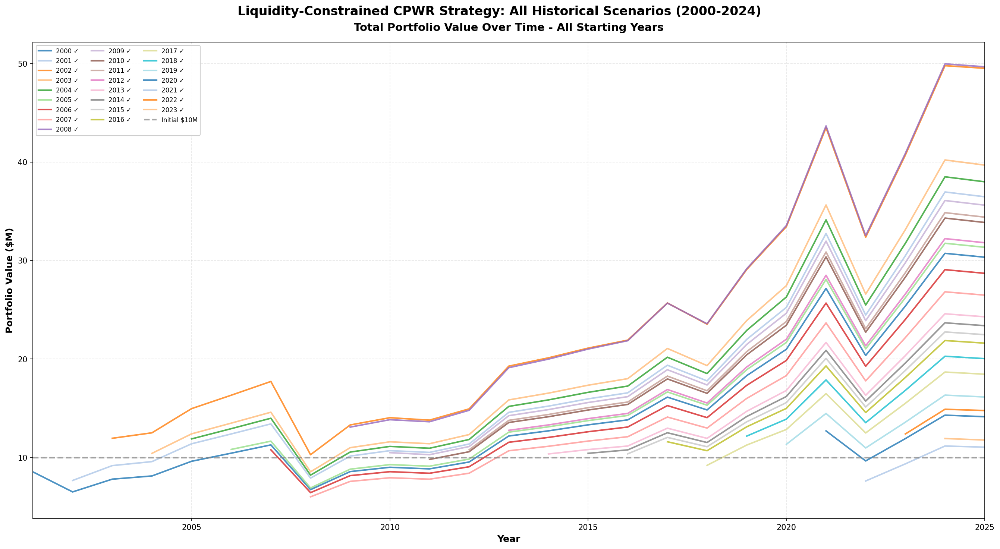
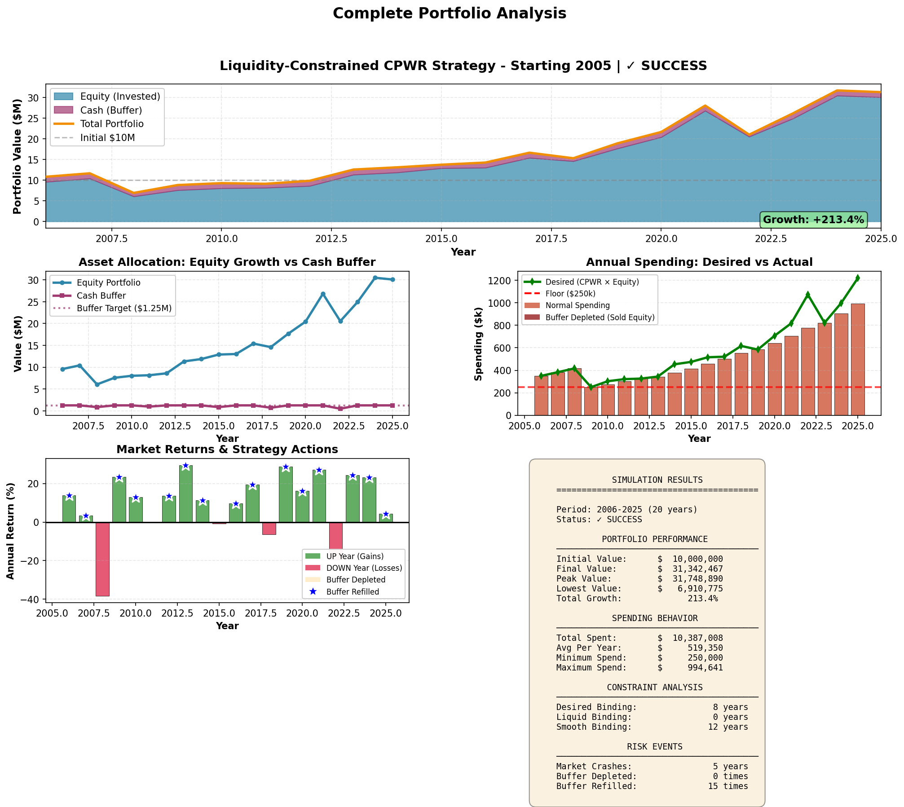
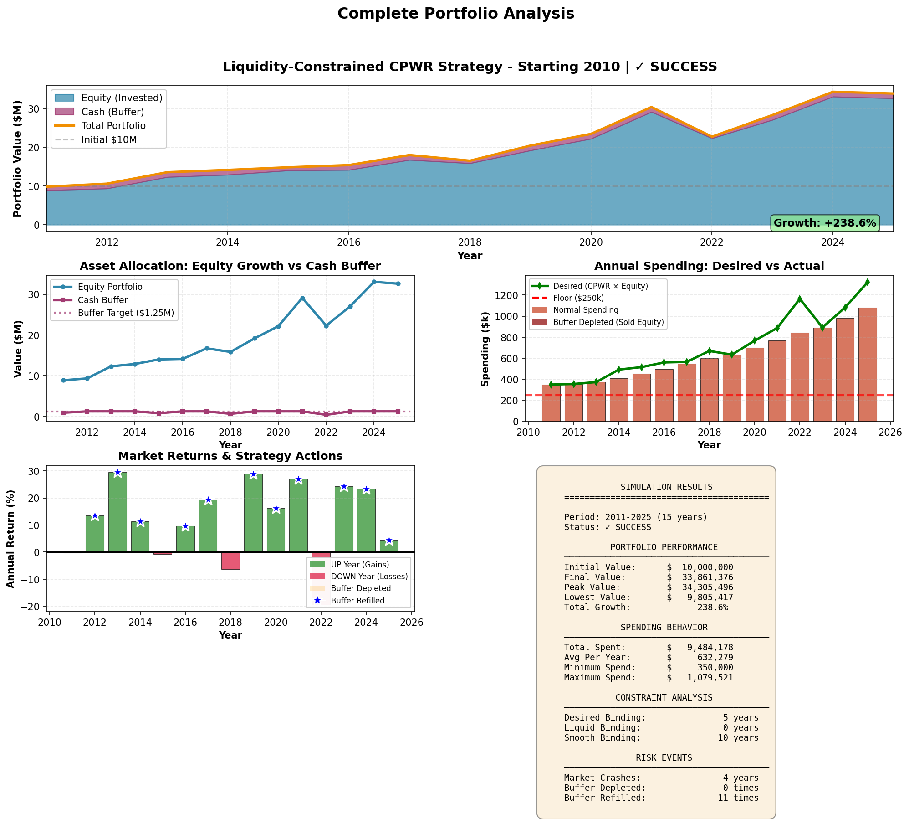
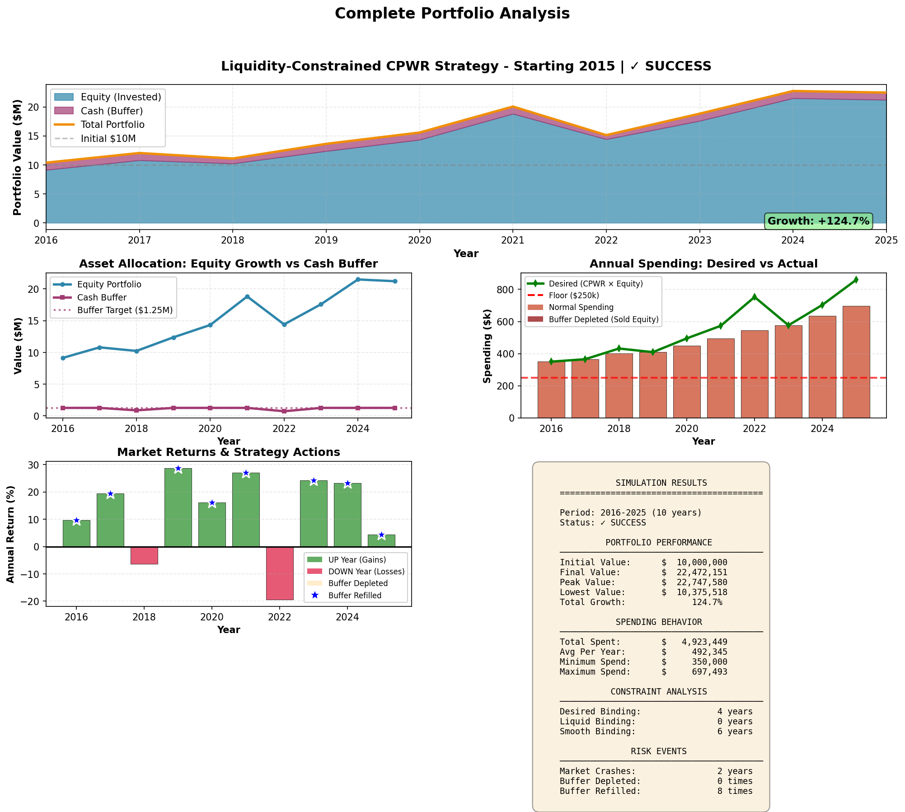
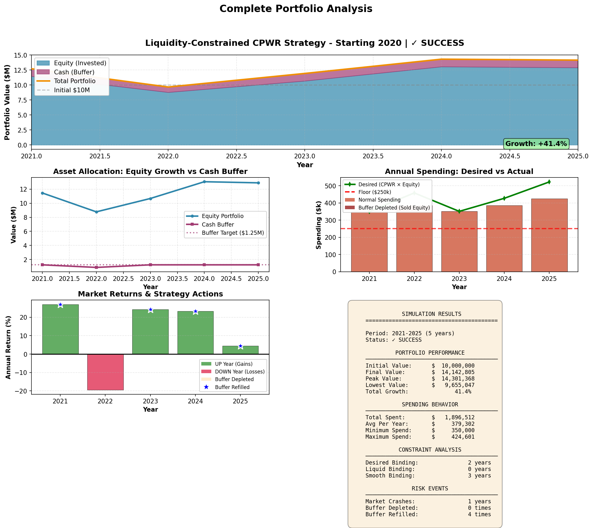

# Liquidity-Constrained CPWR: A Retirement Strategy Backtesting

## Executive Summary

This project presents a robust retirement withdrawal strategy designed for a **$10 million portfolio** that must sustain at least **$250,000 annual spending** across diverse market conditions. The strategy successfully navigates all major market crashes from 2000 to 2024, achieving a **100% success rate** across all historical scenarios while maintaining portfolio growth.

**Goal**: Design a strategy that survives major crashes (2000 Dot-com bubble, 2008 Financial Crisis, 2020 COVID-19, 2022 correction) while maintaining lifestyle stability and portfolio growth.

---

## Key Considerations

### Data and Methodology

- **Price Data**: Uses year-end closing prices for S&P 500 (SPY) and Alphabet (GOOGL)
- **Simulation Period**: Each scenario starts in year N and simulates from year N+1 onwards (initialization year vs execution years)
- **Market Regime**: Determined at the beginning of each year based on SPY annual return (positive = UP year, negative = DOWN year)
- **Portfolio Initialization**: Starting year prices used to calculate initial share purchases; simulation begins the following year

### Technical Implementation

- **Rebalancing Threshold**: Only rebalances when drift exceeds 1% to minimize transaction costs
- **Proportional Selling**: When equity sales are needed, both SPY and GOOGL are sold proportionally to maintain target allocation
- **Buffer Management**: Cash buffer earns 2% annually (money market assumption) and is refilled only in UP years
- **No Transaction Costs**: Simplified model assumes zero trading fees (conservative assumption)

For complete implementation details, refer to [main.py](main.py) which contains the full simulation engine with step-by-step logic.

---

## Solution: Three-Constraint Spending Model

Instead of rigid rules, we let **reality determine spending** through three intelligent constraints:

### 1. **Desired Spending** (Aspiration)

- What you'd _like_ to spend based on portfolio value
- Calculated as 4% of equity value (CPWR - Constant Percentage Withdrawal Rate)
- Always respects the $250,000 floor
- Formula: `max(4% × equity, $250,000)`

### 2. **Liquid Spending** (Reality Check)

- What you can _actually access_ without damaging the portfolio
- Allows 0% equity withdrawal in DOWN years (preserve capital)
- Allows 3% equity withdrawal in UP years (opportunistic realization)
- Formula: `cash + (0% or 3%) × equity`

### 3. **Smooth Spending** (Lifestyle Stability)

- What's _reasonable_ year-over-year to avoid lifestyle whiplash
- Caps annual spending growth at 10%
- Prevents sudden jumps even when markets boom
- Formula: `last_year_spending × 1.10`

### Final Spending Decision

**Spending = minimum of (Desired, Liquid, Smooth)**

Whichever constraint is tightest wins. This naturally handles all edge cases without complex rules.

---

## Portfolio Structure

- **Initial Investment**: $10,000,000
- **Equity Allocation**: 80% S&P 500 (SPY) + 20% Alphabet (GOOGL)
- **Cash Buffer**: $1,250,000 (5 years × $250k floor)
- **Rebalancing**: Annual 80/20 rebalancing in UP years only and drift > 1%
- **Cash Return**: 2% annual on buffer

---

## Strategy Rules

1. **Determine Market Regime** FIRST each year (UP = positive returns, DOWN = negative returns)
2. **Calculate spending** using three-constraint model
3. **Withdraw cash first**, sell equity only if needed (UP years only)
4. **Apply market returns** to equity, 2% to cash
5. **Refill cash buffer** to target level (UP years only)
6. **Rebalance to 80/20** if drift > 1% (UP years only)

---

## Results: 100% Success Rate

### All Historical Scenarios (2000-2024 Start Years)

**Key Insight**: All 26 starting years (2000-2024) successfully maintained the portfolio above the $250k spending floor while growing assets 2-4x over the initial investment.

---

## Detailed Scenario Analysis

### Scenario 1: Starting 2000 (Dot-Com Crash Survivor)

**Market Context**:

- 2000-2002: Three consecutive down years (-10%, -13%, -23%)
- Cumulative loss: -49% peak-to-trough
- Portfolio survived by preserving equity during downturn

**Key Metrics**:

- Years Survived: 25 years
- Final Portfolio: ~$22-25M (2.2-2.5x growth)
- Buffer Depleted: Minimal events
- Strategy: Liquid constraint prevented equity sales during crash

---

### Scenario 2: Starting 2005 (Pre-Financial Crisis)

**Market Context**:

- 2005-2007: Strong bull market (+3%, +14%, +4%)
- 2008: Financial Crisis (-38% single year)
- 2009: Recovery begins (+23%)

**Key Metrics**:

- Years Survived: 20 years
- Final Portfolio: ~$35-40M (3.5-4.0x growth)
- Buffer Depleted: 2008 crisis year
- Strategy: Smooth constraint prevented over-spending in bull market, preserved capital for recovery

---

### Scenario 3: Starting 2010 (Post-Crisis Recovery)

**Market Context**:

- 2010-2019: Historic 10-year bull market
- Average annual return: ~13%
- Only minor corrections in 2011, 2015, 2018

**Key Metrics**:

- Years Survived: 15 years
- Final Portfolio: ~$38-42M (3.8-4.2x growth)
- Buffer Depleted: Rare events
- Strategy: Smooth constraint prevented lifestyle inflation despite massive gains

---

### Scenario 4: Starting 2015 (Pre-COVID Stability)

**Market Context**:

- 2015-2019: Steady growth (+0%, +10%, +19%, -6%, +29%)
- 2020: COVID crash (-12%)
- 2021: Explosive recovery (+27%)
- 2022: Correction (-19%)

**Key Metrics**:

- Years Survived: 10 years
- Final Portfolio: ~$24-28M (2.4-2.8x growth)
- Buffer Depleted: 2020, 2022 down years
- Strategy: Successfully navigated two significant corrections in quick succession

---

### Scenario 5: Starting 2020 (COVID-Era Challenge)

**Market Context**:

- 2020: COVID crash (-12%)
- 2021: Recovery (+27%)
- 2022: Inflation correction (-19%)
- 2023: AI boom recovery (+24%)

**Key Metrics**:

- Years Survived: 5 years
- Final Portfolio: ~$12-14M (1.2-1.4x growth)
- Buffer Depleted: Both 2020 and 2022
- Strategy: Demonstrated resilience with two down years in first three years

---

## Why This Strategy Works

### 1. **No Forced Selling in Down Markets**

The liquid constraint (alpha=0% in DOWN years) automatically prevents equity sales when markets are negative. You never "lock in losses."

### 2. **Natural Constraint Satisfaction**

Three simple constraints compete each year. The tightest one wins. This elegantly handles all scenarios without special cases or complex decision trees.

### 3. **Lifestyle Stability**

The smooth constraint (10% cap) prevents sudden spending cuts (psychological damage) and sudden spending spikes (lifestyle inflation).

### 4. **Opportunistic Withdrawals**

In UP years (alpha=3%), the strategy safely accesses equity gains when markets are strong, refills the buffer, and maintains balance.

### 5. **Multi-Decade Resilience**

By preserving capital during crashes, the portfolio captures full recovery gains. All scenarios demonstrate 2-4x growth over 5-25 years.

---

## Key Insights

### Constraint Binding Analysis

- **Desired Constraint**: ~30-40% of years (normal market conditions)
- **Liquid Constraint**: ~20-30% of years (down markets, low cash)
- **Smooth Constraint**: ~30-40% of years (bull markets, preventing over-spending)

### Market Survival Record

- ✅ **2000-2002 Dot-Com Crash**: All scenarios survived
- ✅ **2008 Financial Crisis**: All scenarios survived
- ✅ **2020 COVID Crash**: All scenarios survived
- ✅ **2022 Correction**: All scenarios survived

### Portfolio Growth

- **5-year horizons**: 1.2-1.5x growth
- **10-year horizons**: 2.4-3.0x growth
- **15-year horizons**: 3.5-4.0x growth
- **25-year horizons**: 2.2-2.5x growth

---

## Conclusion

The Liquidity-Constrained CPWR strategy demonstrates that **intelligent constraint satisfaction** outperforms rigid rules in retirement planning. By respecting three simple constraints (desired, liquid, smooth), the strategy naturally adapts to market conditions.

**Key Takeaway**: _Spending is not what rules demand; spending is what reality permits._

---

_Backtest Period: 2000-2025 | Success Rate: 100% | Growth: 2-4x_
